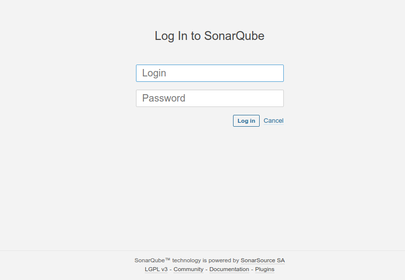
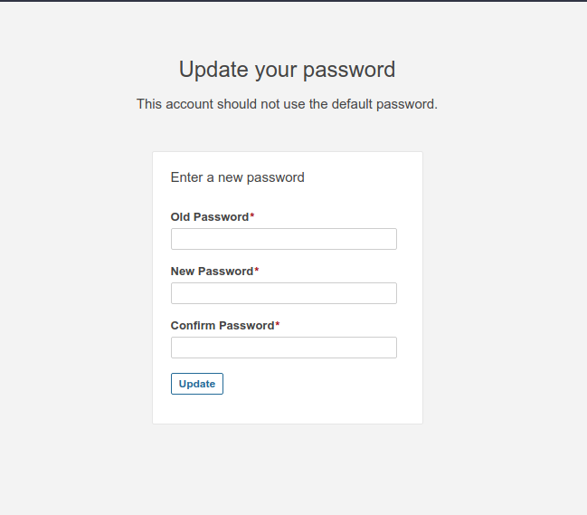
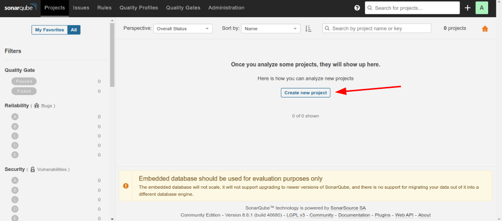
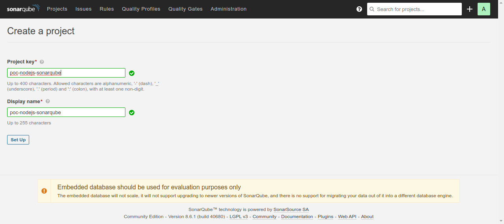
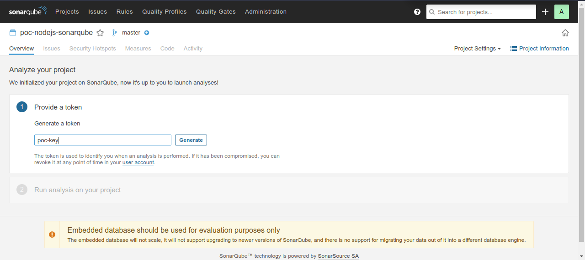
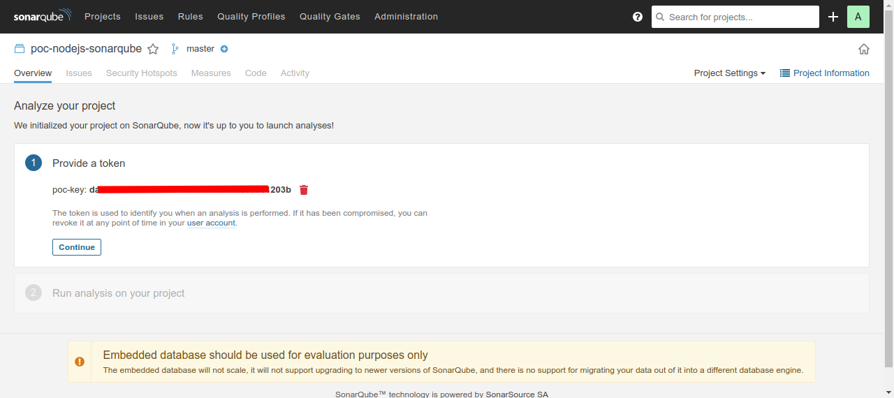
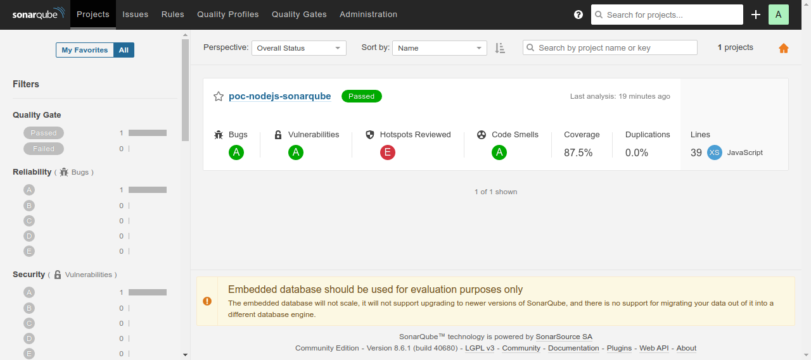

# PoC using Nodejs and SonarQube
a proof of concept using NodeJS, Jest, SonarQube and Docker

## Tools
- NodeJS
- Jest
- SonarQube
- Docker (install your machine)
- Docker Compose (install your machine)

## What's SonarQube?
SonarQube (formerly Sonar) is an open-source platform developed by SonarSource for continuous inspection of code quality to perform automatic reviews with static analysis of code to detect bugs, code smells, and security vulnerabilities on 20+ programming languages. SonarQube offers reports on duplicated code, coding standards, unit tests, code coverage, code complexity, comments, bugs, and security vulnerabilities. [Source Wokipedia](https://en.wikipedia.org/wiki/SonarQube)

## Run project
- Install dependencies:
  ```
  npm i
  ```

- Build images with docker-compose
  ```
  docker-compose build
  ```

- Run project with docker-compose
  ```
  docker-compose up
  ```

## Run tests and configuring sonarqube
After the build is complete, follow these sequential steps:

- Run tests

  First, we need to run the tests to generate statistics on the SonarQube dashboard, for that, run the command:
  ```
  npm run test
  ```
- Configuring SonarQube

  Now, we need to configure sonarqube for the project to be displayed on the dashboard, for that we need to access the URL: `http://localhost:9000` where we will need to login with the credentials:
  ```
  login: admin
  password: admin
  ```
  <div style="margin-bottom: 20px">
    
  </div>

  We will then be required to change the password, as shown in the figure below
  <div style="margin-bottom: 20px">
    
  </div>

  After changing the password we will have access to the dashboard, however, we have no project, so we need to create a project as the arrow points:
  <div style="margin-bottom: 20px">
    
  </div>

  Now we just need to add a key and a name for the project as shown in the figure below:
  <div style="margin-bottom: 20px">
    
  </div>

  Next, we need to create a token, this token will be used to link our project to the project on SonarQube, so we can add a name for this token.
  <div style="margin-bottom: 20px">
    
  </div>
  
  When clicking on `generate` a token will be generated, the next steps will be unnecessary since we are using plugins in the project to carry out the other steps.
  <div style="margin-bottom: 20px">
    
  </div>

  With the token copied, open the file: `sonar-project.js` and add the token as shown below:
  ```js
  const sonarqubeScanner = require('sonarqube-scanner');
  sonarqubeScanner(
    {
      serverUrl:  'http://localhost:9000',
      token: '11111111119a2dee307f28cac2632a1111111111', //your token
      options : {
        'sonar.sources':  'src',
        'sonar.tests':  '__tests__',
        'sonar.inclusions' :  '**',
        'sonar.test.inclusions':  '__tests__/**/*.test.js',
        'sonar.javascript.lcov.reportPaths':  'coverage/lcov.info',
        'sonar.testExecutionReportPaths':  'coverage/test-reporter.xml'
      }
    }, () => {});
  ```

  Next step, synchronize the project with SonarQube, to do this run:
  ```
  npm run sonar
  ```
  This process can take, when you finish the analysis, you can already visualize the project as shown in the figure below:
  <div style="margin-bottom: 20px">
    
  </div>


